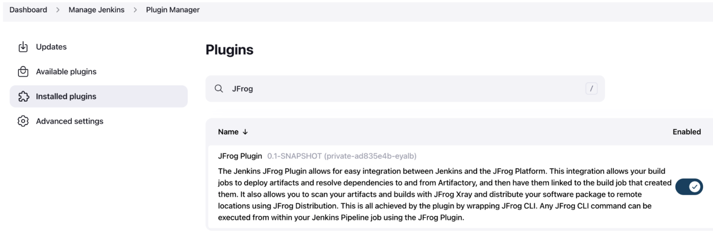
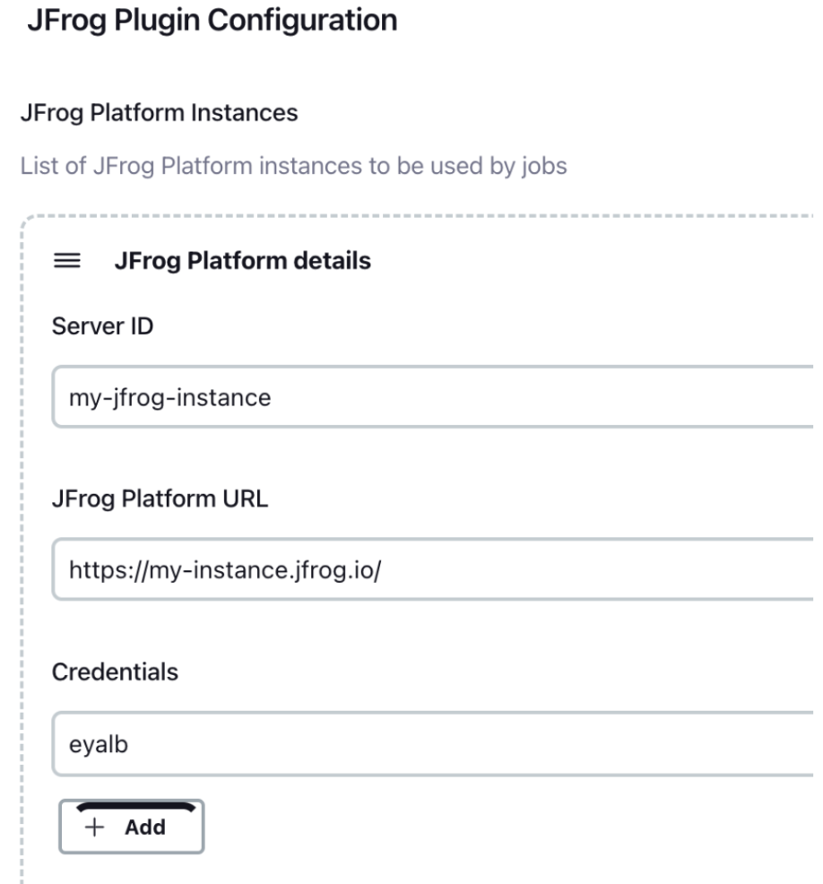
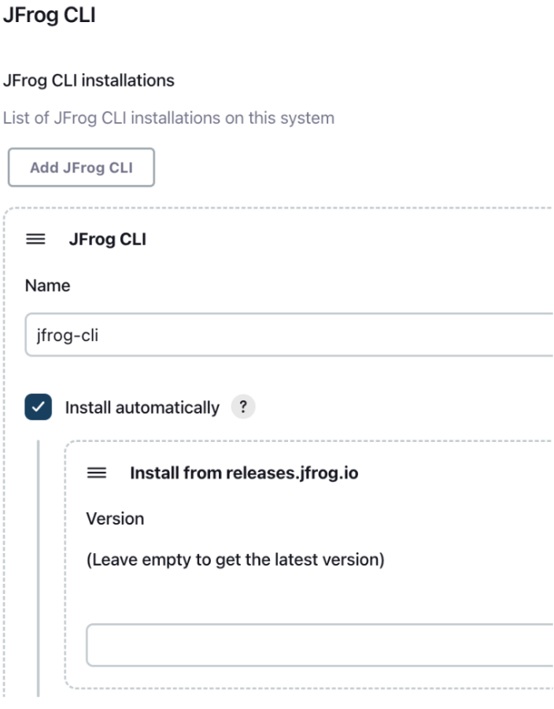
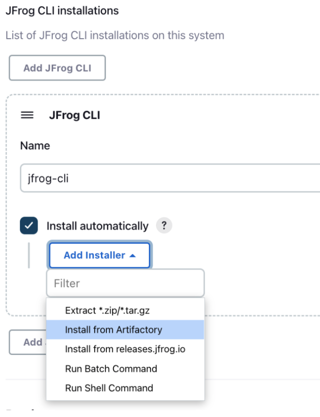
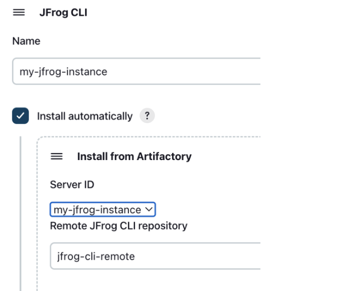
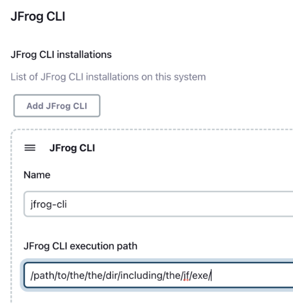

# Jenkins JFrog Plugin

## Table of contents
- [Overview?](#overview)
- [Installing and configuring the plugin](#installing-and-configuring-the-plugin)
- [Configuring JFrog CLI as a tool](#configuring-jfrog-cli-as-a-tool)
- [Using JFrog CLI in your pipeline jobs](#using-jfrog-cli-in-your-pipeline-jobs)
- [Contributions](#contributions)

## Overview
The Jenkins JFrog Plugin allows for easy integration between Jenkins and the JFrog Platform.
This integration allows your build jobs to deploy artifacts and resolve dependencies to and from Artifactory, and then have them linked to the build job that created them. It also allows you to scan your artifacts and builds with JFrog Xray and distribute your software package to remote locations using JFrog Distribution.
This is all achieved by the plugin by wrapping JFrog CLI. Any JFrog CLI command can be executed from within your Jenkins Pipeline job using the JFrog Plugin.

## Installing and configuring the plugin
1. Install the JFrog Plugin by going to **Manage Jenkins | Manage Plugins**.<br>
2. Configure your JFrog Platform details by going to **Manage Jenkins | Configure System**.<br>
3. Configure JFrog CLI as a tool in Jenkins as described in the [Configuring JFrog CLI as a tool](#configuring-jfrog-cli-as-a-tool) section.

## Configuring JFrog CLI as a tool
### General
To use JFrog CLI in your pipelines jobs, you should configure it as a tool in Jenkins by going to **Manage Jenkins | Global Tool Configuration**. You can use one of the following installation options:

### Automatic installation from release.jfrog.io
If your agent has  access to the internet, you can set the installer to automatically download JFrog CLI from https://releases.jfrog.io as shown in the below screenshot.



### Automatic installation from Artifactory
If your agent cannot access the internet, you can set the installer to automatically download JFrog CLI from the JFrog instance you configured in Manage Jenkins | Configure System as shown in the below screenshot. To set this up, follow these steps:

1. Create a remote repository in Artifactory for downloading JFrog CLI. You can name the repository **jfrog-cli-remote**. This is the name we'll be using here, but you can also choose a different name for the repository. Set the repository URL to https://releases.jfrog.io/artifactory/jfrog-cli/v2-jf/

2. In **Manage Jenkins | Global Tool Configuration** select the Install from Artifactory option as shown in the screenshot below.<br>

3. Set the Server ID of your JFrog instanced, which you configured in **Manage Jenkins | Configure System**. Also set **jfrog-cle-remote** as the name of the remote repository you created to download JFrog CLI from. If you used a different name for repository, set this name here.<br>

### Manual installation
Install JFrog CLI manually on your build agent, and then set the path to the directory which includes the jf executable, as shown in the below screenshot.



## Using JFrog CLI in your pipeline jobs
To have your pipeline jobs run JFrog CLI commands, add the following to your pipeline script.

**Step 1:**
Define JFrog CLI as a tool, by using the tool name you configured. For example, if you named the tool *jfrog-cli*, add the following to the script: 
```groovy
tools {
    jfrog "jfrog-cli"
}
```

**Step 2:**
Use the **jf** step to execute any JFrog CLI command as follows:
```groovy
// Upload all files in the target directory to the my-repo Artifactory repository.
jf 'rt u target/ my-repo/'
```
> **_IMPORTANT:_** Notice the single quotes wrapping the command right after the **jf** step definition.  

**Example**
```groovy
pipeline {
    agent any
    environment {
        JFROG_CLI_BUILD_NAME = “$JOB_NAME”
        JFROG_CLI_BUILD_NUMBER = “$BUILD_NUMBER”
    }
    tools {
        jfrog "jfrog-cli"
    }
    stages {
        stage ('Testing') {
            steps {
                // Show the installed version of JFrog CLI.
                jf '-v'
                
                // Show the configured JFrog Platform instances.
                jf 'c show'
                
                // Ping Artifactory.
                jf 'rt ping'
                
                // Create a file and upload it to a repository named 'my-repo' in Artifactory
                sh 'touch test-file'
                jf 'rt u test-file my-repo/'
                
                // Publish the build-info to Artifactory.
                jf 'rt bp'
            }
        }
    }
}
```
> **_NOTE:_** If you have multiple JFrog Platform instances configured, you can use the –server-id command option with the server ID you configured for the instance. For example:
```groovy
jf 'rt u test-file my-repo –server-id my-server-id'
```

## Contributions
We welcome code contributions through pull requests from the community.


